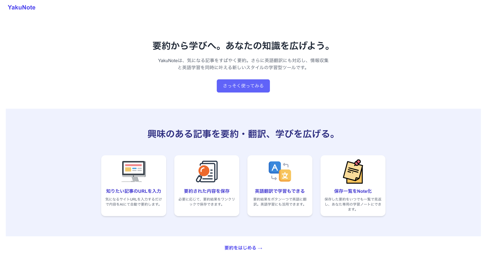

# Yakunote（ヤクノート）

AI要約 × 保存 × 英語翻訳機能を備えた、記事要約Webアプリです。
下記はサービスのURLです。ログイン不要で要約を試せます。
https://yaku-note.vercel.app/

---

##  概要

URLを入力 → 本文抽出 → 要約 → 保存・翻訳までを一貫して行えるモダンなWebアプリです。  
React / Next.js / FastAPI / Supabase / OpenAI API などを使用しています。
※現在は個人利用のみを想定のため、Googleログイン機能は１ユーザーのみ認証可能にしております

---

##  使用技術（スタック）

- **フロントエンド**: React / Next.js / TypeScript / Tailwind CSS
- **バックエンド**: Python / FastAPI
- **認証**: Supabase Auth（Google OAuth）
- **DB**: Supabase（PostgreSQL）
- **AI連携**: OpenAI API（GPT-3.5-turbo）
- **インフラ**: Vercel / Supabase Hosting

---

## 主な機能

-  URL入力で本文自動抽出（trafilatura）
-  要約の自動生成（OpenAI連携）
-  要約データの保存・一覧表示（Supabase DB）
-  Googleログインでユーザー管理
-  英語 ⇔ 日本語の切り替え翻訳機能

---

## 画面イメージ

### 🔹 トップページ（URL入力）

### 🔹 要約開始画面

### 🔹 要約結果表示

### 🔹 翻訳結果表示

### 🔹 保存一覧ページ

### 🔹 保存詳細ページ

---

